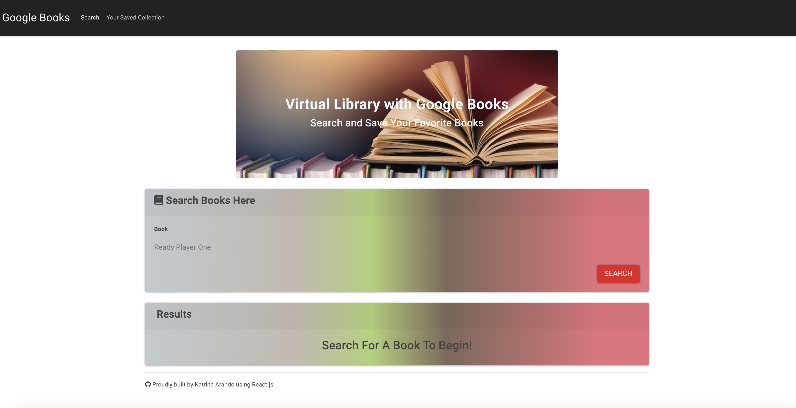

# Virtual Library Using Google Books

### Overview

This is a React-based Google Books Search app that allows users to search for books via the Google Books API, view and save them. 

### Development
The app is a SPA (Single Page Application) that uses [`react-router-dom`](https://github.com/reactjs/react-router) to navigate, display and hide React components without modifying the routes within Express. 

Node, Express and MongoDB are used to save user selected books that they can later review or purchase. 

### Production
This app is deployed using Heroku.  Please visit the Heroku link provided to test the app's functionality. 

### Product Demo
